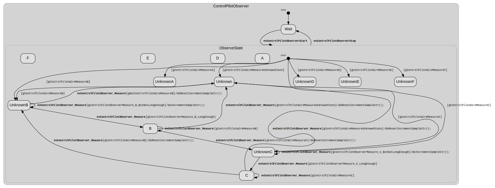
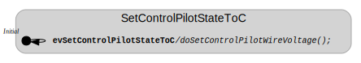
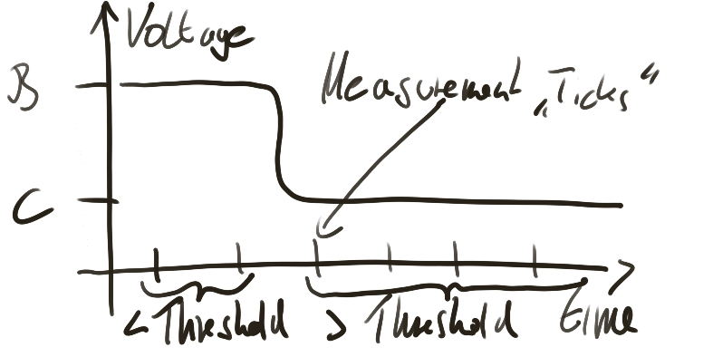

# ControlPilotObserver state machine

ControlPilotObserver specifies how to detetct a control pilot state X (X= A,B,C,D,E,F). It's main ingredients are the sampling event `evControlPilotObserver_Measure` and a set of guards
of the form `gControlPilotWireMeasureX`, `gNotControlPilotWireMeasureX`, `gControlPilotObserverMeasure_X_LongEnough`, `gControlPilotObserverMeasure_X_ButNotLongEnough` (X= A,B,C,D,E,F), and the systemstates
`ControlPilotObserver_CountOfConsecutiveConstantMeasurements` and `ControlPilotObserver_DetectStateThreshold`. 
The idea is quite simple: a state X is recognized if for a large enough number (`ControlPilotObserver_DetectStateThreshold`) of consecutive measurements the voltage on the control pilot line is in [RangeXMin,RangeXMax]. 

## ControlPilotObserver state chart (generated drawing - messy)



## Easy Examples


### ControlPilotObserver remains in a wait state if started.


#### Steps


```javascript
Start state machine ControlPilotObserver.
```

#### Result
```javascript
ControlPilotObserver.Initial- ControlPilotObserver.Wait+ 
```

#### How to run this example from the shell
```bash
ceps ../../common.ceps ../../timing.ceps ../controlpilot_interface.ceps ../controlpilot.ceps controlpilot_observer_interface.ceps controlpilot_observer.ceps readme_scenario_1.ceps 
```


### ControlPilotObserver needs a trigger to start/stop  'observing' .


#### Steps


```javascript
Start state machine ControlPilotObserver.
```

```javascript
Trigger Event evControlPilotObserverStart.
```

```javascript
Trigger Event evControlPilotObserverStop.
```

#### Result
```javascript
ControlPilotObserver.Initial- ControlPilotObserver.Wait+ 
ControlPilotObserver.Wait- ControlPilotObserver.ObserveState+ ControlPilotObserver.ObserveState.Initial+ 
ControlPilotObserver.ObserveState.Initial- ControlPilotObserver.ObserveState.UnknownE+ 
ControlPilotObserver.Wait+ ControlPilotObserver.ObserveState- ControlPilotObserver.ObserveState.UnknownE- 
```

#### How to run this example from the shell
```bash
ceps ../../common.ceps ../../timing.ceps ../controlpilot_interface.ceps ../controlpilot.ceps controlpilot_observer_interface.ceps controlpilot_observer.ceps readme_scenario_2.ceps 
```


### ControlPilotObserver 'observes' a state if a sufficient number of equivalent and consecutive measurements are detected.


#### Steps


```javascript
ControlPilotObserver_ExternallyGeneratedSamplingEvents = 1 /*The default behaviour of ControlPilotObserver
is to periodically generate sampling events, we provide these events.*/ 
```

```javascript
ControlPilotObserver_DetectStateThreshold = 2 /*ControlPilotObserver_DetectStateThreshold+1 is the number
of consecutive equivalent measurements required to detect a state.*/ 
```

```javascript
ControlPilotWireVoltageMeasurement = (ControlPilotStateBMin+((ControlPilotStateBMax-ControlPilotStateBMin)/2)) /*
Constant voltage signal indicating state B.*/ 
```

```javascript
Start state machine ControlPilotObserver.
```

```javascript
Trigger Event evControlPilotObserverStart.
```

```javascript
Trigger Event evControlPilotObserver_Measure.
```

```javascript
Trigger Event evControlPilotObserver_Measure.
```

```javascript
Trigger Event evControlPilotObserver_Measure.
```

#### Result
```javascript
ControlPilotObserver.Initial- ControlPilotObserver.Wait+ 
ControlPilotObserver.Wait- ControlPilotObserver.ObserveState+ ControlPilotObserver.ObserveState.Initial+ 
ControlPilotObserver.ObserveState.Initial- ControlPilotObserver.ObserveState.UnknownB+ 
ControlPilotObserver.ObserveState.UnknownB- ControlPilotObserver.ObserveState.B+ 
```

#### How to run this example from the shell
```bash
ceps ../../common.ceps ../../timing.ceps ../controlpilot_interface.ceps ../controlpilot.ceps controlpilot_observer_interface.ceps controlpilot_observer.ceps readme_scenario_3.ceps 
```

### A helper state machine



The depicted state machine serves us as a switch, which sets the measured voltage on the control pilot to a 'state C' compatible voltage level. 
The mechanics is quite simple: the state machine has a single transition with the sole purpose to trigger the action 
`doSetControlPilotWireVoltage` whenever the event evSetControlPilotStateToC has occured.

### ControlPilotObserver goes through the chain of states UnknownX => Unknown => UnknownY => Y if the measured voltage changes quickly from X to Y and remains at Y long enough.


#### Steps


```javascript
ControlPilotObserver_ExternallyGeneratedSamplingEvents = 1 /*The default behaviour of ControlPilotObserver
is to periodically generate sampling events, we provide these events.*/ 
```

```javascript
ControlPilotObserver_DetectStateThreshold = 2 /*ControlPilotObserver_DetectStateThreshold+1 is the number
of consecutive equivalent measurements required to detect a state.*/ 
```

```javascript
ControlPilotWireVoltageMeasurement = (ControlPilotStateBMin+((ControlPilotStateBMax-ControlPilotStateBMin)/2)) /*
Constant voltage signal indicating state B.*/ 
```

```javascript
Start state machines ControlPilotObserver, SetControlPilotStateToC.
```

```javascript
Trigger Event evControlPilotObserverStart.
```

```javascript
Trigger Event evControlPilotObserver_Measure.
```

```javascript
Trigger Event evControlPilotObserver_Measure.
```

```javascript
evSetControlPilotStateToC /*Sets the voltage level to 'C' shortly before 'B' would be detected.
Please note, that this event doesn't affect ControlPilotObserver, i.e.
the change will be detected only after an additional sampling event which resets
the sampling counter of ControlPilotObserver. Hence 4 sampling events in total are required for the detection of 'C'.*/ 
```

```javascript
Trigger Event evControlPilotObserver_Measure.
```

```javascript
Trigger Event evControlPilotObserver_Measure.
```

```javascript
Trigger Event evControlPilotObserver_Measure.
```

```javascript
Trigger Event evControlPilotObserver_Measure.
```

#### What the steps above mean in terms of the voltage signal on CLPLT



#### Result
```javascript
ControlPilotObserver.Initial- ControlPilotObserver.Wait+ 
ControlPilotObserver.Wait- ControlPilotObserver.ObserveState+ ControlPilotObserver.ObserveState.Initial+ 
ControlPilotObserver.ObserveState.Initial- ControlPilotObserver.ObserveState.UnknownB+ 
ControlPilotObserver.ObserveState.Unknown+ ControlPilotObserver.ObserveState.UnknownB- 
ControlPilotObserver.ObserveState.Unknown- ControlPilotObserver.ObserveState.UnknownC+ 
ControlPilotObserver.ObserveState.UnknownC- ControlPilotObserver.ObserveState.C+ 
```

#### How to run this example from the shell
```bash
ceps ../../common.ceps ../../timing.ceps ../controlpilot_interface.ceps ../controlpilot.ceps controlpilot_observer_interface.ceps controlpilot_observer.ceps readme_scenario_4a.ceps readme_scenario_4b.ceps >> README.md 
```

